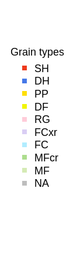

# sarp.snowprofile

Functions to import/export snow profile data from various formats, as well as basic formatting and visualization functions.

## Installation

Install CRAN release via `install.packages('sarp.snowprofile')` and track development at https://bitbucket.org/sfu-arp/sarp.snowprofile.

## Examples

View `vignette('sarp.snowprofile')` for a package overview.
